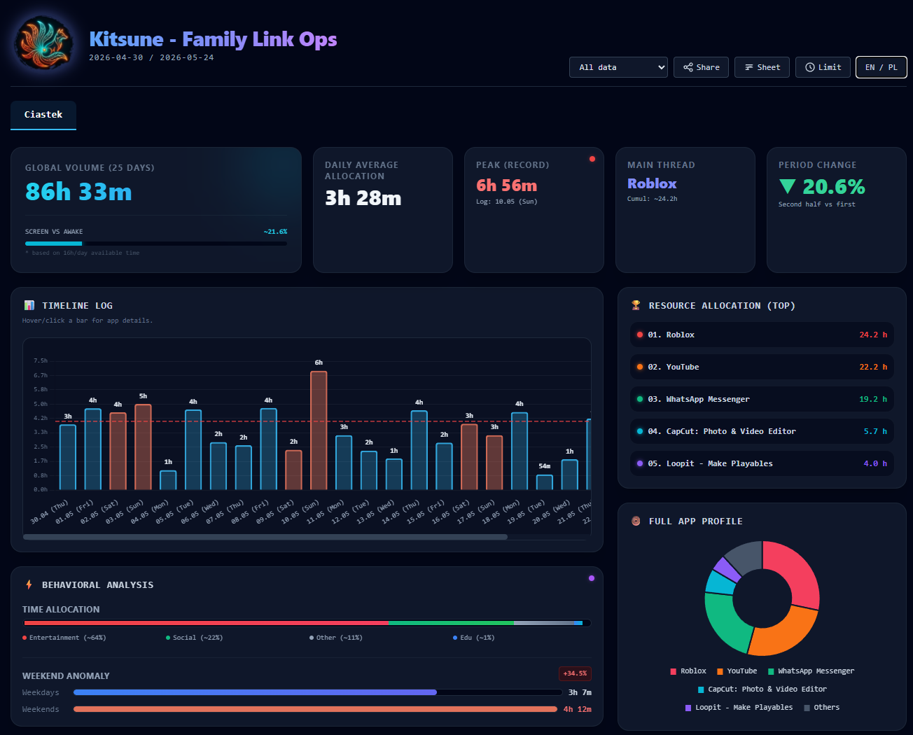
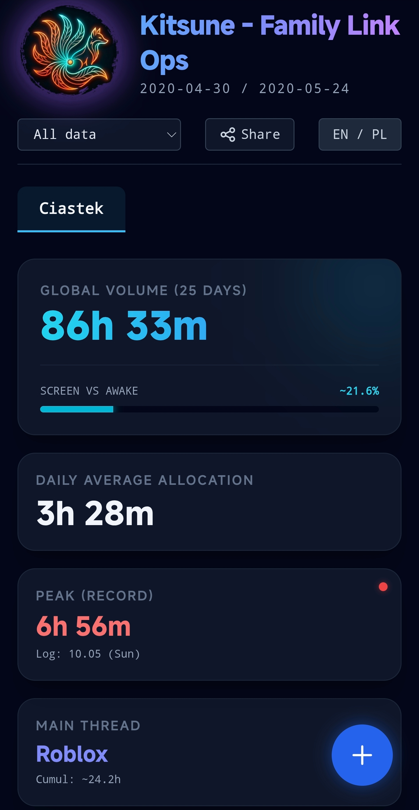
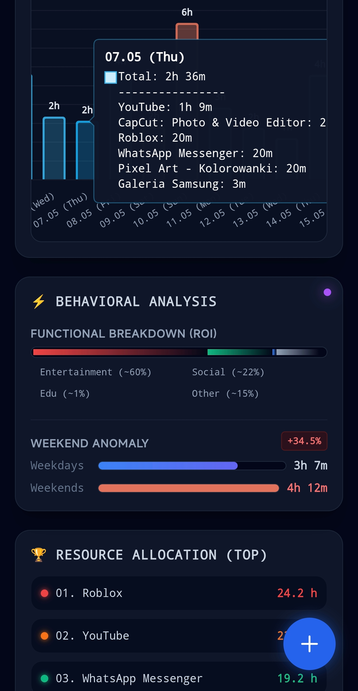

# 🦊 Kitsune — Family Link Ops

**AI-powered screen time analytics for Google Family Link.**

Google Family Link doesn't export data or provide usage statistics. This tool bridges that gap — you take screenshots of the daily screen time view, compile them into a PDF, upload it, and Gemini AI extracts structured data automatically. The result is a full analytics dashboard with behavioral insights, trend analysis, threshold-based monitoring, and multi-child support.

Built on zero-cost, zero-infrastructure Google Workspace stack: **Apps Script + Gemini API + Google Sheets + Drive**.

---

## 📸 Screenshots

### Desktop



### Mobile

<p align="center">
  
  
</p>

---

## ✨ Features

### Core analytics
- **AI PDF extraction** — Gemini multimodal API reads screenshots of Family Link reports and extracts structured time data per app, per day
- **Automatic categorization** — Gemini classifies each app (Entertainment / Social / Education / Other) at extraction time, no manual configuration
- **Multi-child support** — tab-based switching between profiles, all data in one Sheets SSoT
- **Time filters** — Last 7/30 days, current month/quarter/year, or any specific month from your data
- **Behavioral analysis** — Functional breakdown (Time Allocation), Weekend Anomaly detection (weekday vs weekend delta)
- **Timeline log** — day-by-day bar chart with per-app tooltip; auto-aggregates to monthly view for larger datasets

### Threshold management *(new in V3.0)*
- **Per-child daily limit** — set max minutes per day per child via modal UI
- **Visual alert** — red dashed line on chart marks the threshold; bars above signal limit breach
- **Centralized config** — stored in Script Properties, consistent across devices and shared links

### Period dynamics *(new in V3.0)*
- **Internal trend indicator** — splits filtered period in half, compares averages, shows direction (▲ worsening / ▼ improving)
- **Auto-shown** when filtered period contains 4+ days, hidden otherwise

### UX upgrades *(new in V3.0)*
- **Smart upload modal** — pick any PDF (any filename), modal asks which child the data belongs to, system handles filename generation automatically
- **Live progress feedback** — animated spinner + persistent banner during 60-90s Gemini processing
- **Auto-refresh** — dashboard updates itself when new data lands in Sheets; no manual F5 needed
- **ESC to close modals** — keyboard navigation for all dialogs
- **Direct Sheets access** — header button opens the SSoT for manual data corrections

### Sharing & access control
- **Admin / Viewer roles** — shareable read-only link via URL parameter (`?role=viewer`); upload, share, threshold, and Sheets buttons hidden automatically
- **Bilingual UI** — Polish / English toggle, all labels translated
- **Fully mobile-responsive** — tested on Android Chrome

---

## 🏗️ Architecture

```
[User]
  └─ Screenshots of Family Link daily view
       └─ Compiled into PDF (any filename)
            └─ Uploaded via FAB button (+ in corner)
                 └─ Upload modal: select child → filename auto-generated
                      └─ Saved to Google Drive / Dropzone folder
                           └─ One-shot trigger fires processDropzone (~30-60s later)
                                └─ extractDataWithGemini()
                                     └─ Gemini multimodal API (with 4-model fallback chain)
                                          └─ Structured JSON: { date, apps: { name: { min, category } } }
                                               └─ upsertToSheet() → Google Sheets SSoT
                                                    └─ Frontend polling detects update
                                                         └─ Dashboard auto-refreshes
```

**Stack:**

- `Code.gs` — Google Apps Script backend (data pipeline, Gemini API calls, Drive/Sheets operations, threshold management, polling endpoint)
- `Index.html` — Single-page frontend served by GAS HtmlService (Tailwind CSS, Chart.js, chartjs-plugin-annotation)
- `appsscript.json` — Manifest with explicit OAuth scopes
- Google Sheets — SSoT for all extracted telemetry data
- Google Drive — Dropzone (incoming PDFs) and Archive (processed PDFs)
- Gemini API — multimodal PDF parsing and app categorization
- Script Properties — per-child threshold storage

**No servers. No databases. No subscriptions. No recurring cost beyond Gemini API usage (free tier covers typical family use).**

---

## 🚀 Setup

### Prerequisites

- Google account (same account used for Family Link)
- Gemini API key — free at [aistudio.google.com/apikey](https://aistudio.google.com/apikey)

### Steps

**1. Create the Apps Script project**

Go to [script.google.com](https://script.google.com) → **New project**

In the editor:

- Rename `Code.gs` → paste the contents of `Code.gs` from this repo
- Click **"+"** next to Files → **HTML** → name it `Index` → paste contents of `Index.html`
- **Project Settings** (gear icon) → check **"Show 'appsscript.json' manifest file in editor"**
- Open the newly-visible `appsscript.json` → paste contents from this repo (contains required OAuth scopes)

**2. Authorize the script**

In the GAS editor, function dropdown → select `forceAuthorize` → click **Run**.
GAS will prompt for permissions. Review and grant all requested scopes.

**3. Deploy as Web App**

Click **Deploy** → **New deployment**

- Type: **Web App**
- Execute as: **Me**
- Who has access: **Anyone** (required for the viewer link to work)

Copy the deployment URL.

**4. First run — Setup screen**

Open the deployment URL. You'll see the Setup screen asking for your Gemini API key.

Paste your key (format: `AIzaSy...`, 35+ characters) → click **Wdróż Ekosystem**.

The script will automatically create:

- `Kitsune_Link_Ops_System/` folder in your Google Drive
- `Dropzone/` subfolder (incoming PDFs)
- `Archiwum/` subfolder (processed PDFs)
- Headers in the active Sheets tab

**5. Upload your first PDF**

Family Link doesn't export data — you need to capture it manually:

1. Open Google Family Link app → tap your child's name → **App activity**
2. Screenshot each day's screen time breakdown
3. Compile screenshots into a single PDF document (any filename works)
4. Tap the **+** button in the dashboard → select your PDF
5. The upload modal will ask which child the data belongs to — pick from list or add new child
6. Watch the live progress banner; data appears automatically within ~60-90 seconds

> **Note:** No need to set up time-based triggers manually. The system creates a one-shot trigger automatically on each upload.

---

## 🎛️ Configuration

### Setting a daily screen-time threshold

Click the **Limit** button in the header → enter daily limit in minutes (e.g. 120 = 2h, 180 = 3h, 0 = disabled) → save. The threshold is per-child and persists across sessions. A red dashed line appears on the chart at the threshold level.

### Switching language

Click **PL / EN** toggle in the header. All labels, tooltips, and modal text update instantly.

### Sharing read-only access

Click **Share** in the header → copy the **Viewer link** → recipient sees the dashboard without admin controls (upload, threshold, Sheets, share are all hidden).

---

## 📁 File naming convention

As of V3.0, you no longer need to name PDFs manually. The upload modal handles naming automatically. Just upload any PDF, then select the child it belongs to.

If uploading PDFs directly to the Drive Dropzone folder (bypassing the UI), use this format:

```
ChildName_Period.pdf

Examples:
  Ciastek_2026-05.pdf
  Maks_2026-Q1.pdf
```

---

## 🗂️ Sheets data structure

| Column | Field         | Format                                                             |
| ------ | ------------- | ------------------------------------------------------------------ |
| A      | Child name    | `String`                                                           |
| B      | Date          | `YYYY-MM-DD`                                                       |
| C      | Total minutes | `Integer`                                                          |
| D      | Apps payload  | `JSON: { "AppName": { "min": 120, "category": "entertainment" } }` |

---

## ⚠️ Known behaviors

- **Manual data capture** — Family Link has no export API. Screenshots must be taken manually per day.
- **Screenshot quality** — Gemini extraction accuracy depends on screenshot clarity. Blurry or cropped screenshots may cause missing data for that day.
- **Trigger delay** — Google's trigger scheduler polls at ~30-60s intervals; `processDropzone` fires that much after upload, not the requested 10s. This is a hard GAS platform limit.
- **Gemini processing time** — 40-140 seconds depending on PDF size. Polling timeout is 4 minutes (safety margin).
- **GAS execution limit** — 6 minutes per execution. Very large PDFs (50+ days in one file) may hit the limit. Recommended: one PDF per month.
- **Screen ratio metric** — "Screen vs Awake" is calculated against a fixed 16h/day denominator. It's a relative indicator, not a precise measurement.

---

## 🔐 Privacy

All data stays within your Google account. No data is sent to any third-party service except:

- **Gemini API** — receives the PDF content for extraction. Subject to [Google AI usage policies](https://ai.google.dev/gemini-api/terms).

The viewer link (`?role=viewer`) disables admin controls but does not add authentication. Anyone with the link can view the data. Share accordingly.

---

## 🛣️ Roadmap

**Done (V3.0):**
- Per-child threshold management with visual chart annotation
- Period dynamics trend indicator (KPI tile)
- Live upload progress feedback + auto-refresh polling
- Smart upload modal (filename auto-generation, child selection)
- Direct SSoT access from UI

**Next (V4.0 — heatmap analytics):**
- Calendar-style heatmap view for >35 day periods
- Day-of-week pattern surfacing
- Threshold-aware color intensity

**Planned:**
- Per-app drill-down view
- PDF export of period reports
- Inactive-upload reminders

---

## 📄 License

MIT — use it, fork it, adapt it.

---

*Part of the [Kitsune](https://github.com/CoffeeDiver) personal automation ecosystem — built with Google Apps Script and Gemini AI.*
