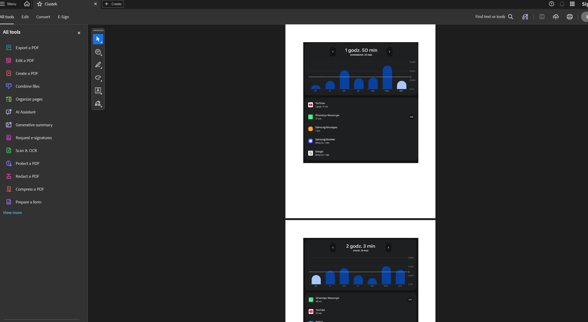

# Kitsune: Family Link Ops

> **A parental screen time analytics dashboard built on Google Apps Script + Gemini API.**
> Upload a Google Family Link PDF export → get structured behavioral data, per-app drill-downs, usage heatmaps, and automated upload reminders. No database. No server. No recurring cost.


---

## What problem does this solve?

Google Family Link generates weekly PDF reports of your child's app usage. These PDFs are readable — but not analyzable. You can't filter by date range, compare weeks, spot usage spikes, or identify which apps are dominating screen time over time.

Family Link Ops ingests those PDFs automatically, extracts the data using Gemini, stores it in Google Sheets as a single source of truth, and presents it as an interactive dashboard with filtering, heatmaps, per-app drill-downs, and configurable usage threshold alerts.

---

## Demo 1 — Upload Pipeline

> *One PDF in. Structured data out. Fully automated.*

<video src="https://github.com/user-attachments/assets/625e26d5-2a80-4ccc-9ece-7d7cfc6cd650" autoplay loop muted playsinline controls></video>

**What's happening:**
1. User clicks upload, selects child profile, drops PDF
2. File lands in a designated Google Drive Dropzone folder
3. A time-based GAS trigger fires (~30-60s after upload)
4. Gemini 2.5 Flash extracts app names, usage times, and dates from the PDF
5. Data is upserted into Google Sheets (keyed on `user_date` — no duplicates)
6. Dashboard auto-refreshes via polling, new data appears in all charts

**Extraction fallback chain:** `gemini-2.5-flash → gemini-2.0 → gemini-1.5 → gemini-1.5-pro`

No manual data entry. No parsing scripts. No schema maintenance.

---

## Demo 2 — Analytics & Drill-Down ⭐

> *Not just numbers — behavioral patterns. Per app. Per day. Per child.*

<video src="https://github.com/user-attachments/assets/45bb25fb-fb3e-4c6f-80db-aa865b229256" autoplay loop muted playsinline controls></video>

**What's happening:**
1. Switch between child profiles — charts update independently
2. Apply date range filter — all visualizations respond in sync
3. Scroll to usage heatmap — intensity gradient reveals daily pattern
4. Click an app in the Top 3 list (or a doughnut chart segment)
5. Drill-down modal opens: 4 KPI tiles + per-day bar chart for that app
6. Y-axis auto-formats: `< 60 min → Xm` / `≥ 60 min → X.Xh`

**Dashboard charts:**
- Daily usage bar chart (timeline)
- App profile doughnut chart
- Trend line overview (≥14 days of data required)
- Usage heatmap (≥14 days of data required)
- Per-app drill-down bar chart (modal, on demand)

**Drill-down KPIs per app:**
| Metric | Description |
|--------|-------------|
| Total | Sum across active days in selected range |
| Daily avg | Average over *active days only* (zero days excluded) |
| Peak | Single highest usage day |
| Active days | Days where the app had any recorded usage |

---

## Demo 3 — Configuration & Sharing

> *Configurable. Alerting built-in. Shareable read-only view.*

<video src="https://github.com/user-attachments/assets/3483e7c8-f094-4f87-970c-a71d05fb307b" autoplay loop muted playsinline controls></video>

**What's happening:**
1. **Usage threshold** — set a daily screen time limit per child (minutes); dashboard highlights breaches
2. **Upload reminder** — configure a delay (1-30 days); automated daily trigger sends a bilingual email (PL/EN) if no new data has arrived
3. **Share modal** — generates a Viewer link (`?role=viewer`) with upload controls and configuration stripped out; safe to share with a co-parent or family member

**Viewer mode removes:** upload FAB, share button, threshold config, reminder config, Sheets link
**Viewer mode retains:** all analytics, all filters, drill-down, heatmap, trend line

---

## Architecture

```
[Google Family Link PDF]
        │
        ▼
[Google Drive — Dropzone Folder]
        │
        ▼  (GAS time-based trigger, ~30-60s)
[Code.gs — processDropzone()]
        │
        ▼
[Gemini API — extractDataWithGemini()]
  fallback chain: 2.5-flash → 2.0 → 1.5 → 1.5-pro
        │
        ▼
[Google Sheets — SSoT]
  key: user_date (upsert, no duplicates)
        │
        ▼
[Index.html — Dashboard]
  getTelemetryData() → JSON → Chart.js rendering
        │
        ├── Polling: getLastUpdateTime() every N seconds
        ├── Filters: per-child tab + date range
        ├── Modals: threshold / reminder / share / drill-down
        └── Viewer mode: ?role=viewer param strips write access
```

**Stack:**
- **Runtime:** Google Apps Script (serverless, no infrastructure)
- **Storage:** Google Sheets (SSoT) + Google Drive (Dropzone + Archive)
- **AI extraction:** Gemini API (multimodal PDF parsing)
- **Frontend:** Vanilla JS + Tailwind CSS (CDN) + Chart.js 4.4.9
- **Auth:** GAS deployment scopes — no user accounts, no OAuth flows
- **i18n:** Full PL/EN bilingual UI with runtime language switch

**Script Properties (configuration store):**

| Property | Description |
|----------|-------------|
| `GEMINI_API_KEY` | Gemini API key |
| `DROPZONE_FOLDER_ID` | Drive folder ID for incoming PDFs |
| `ARCHIVE_ID` | Drive folder ID for processed PDFs |
| `LAST_UPLOAD_TIMESTAMP` | Epoch ms — tracks last upload event |
| `REMINDER_DAYS` | Int 1-30, default 3 |
| `REMINDER_EMAIL` | Reminder recipient address |
| `LAST_REMINDER_SENT` | Epoch ms — one email per cycle guard |
| `threshold_{userName}` | Per-child limit in minutes (0-1440) |

---

## Input Format — The Source PDF

This is the actual input the system processes. No synthetic data, no manually structured files — a raw Google Family Link PDF export, exactly as downloaded from the Family Link app.



Google Family Link generates these reports weekly. The PDF contains app usage data per day in a semi-structured layout — readable by a human, not queryable by a machine. Gemini parses the visual structure of the document to extract app names, usage durations, and dates, handling layout variations across report versions.

**What Gemini extracts from each PDF:**
- Child profile name (from filename: `{ChildName}_{ISO date}`)
- App names
- Usage time per app per day (in minutes)
- Report date range

> **Screenshot note:** Child name and any identifying data visible in the PDF should be blurred before sharing. The pseudonym "Ciastek" is used throughout this project.

---

## Known Behaviors & Limitations

| Behavior | Detail |
|----------|--------|
| Processing delay | ~30-60s after upload (GAS trigger platform limit) |
| Gemini extraction time | 40-140s depending on PDF size |
| Heatmap / trend line | Require ≥14 days of data in selected filter |
| Email validation | Format-only (regex). Typo → silent delivery to void, no UI error |
| Upload reminder | One email per cycle. Resets automatically on next upload. |
| GAS daily execution quota | 6 min/day (free tier). Not suitable for public traffic. |
| GAS concurrent connections | Max 30. Viewer link safe for 1-2 users, not public burst. |
| Chart.js | Pinned to 4.4.9. Plugin `chartjs-plugin-annotation` pinned to v3. |
| First-load lag | ~1s due to base64 inline logo (expected, by design) |
| Reminder trigger window | Fires between 09:00-10:00 script timezone (GAS `atHour()` guarantee) |

---

## Installation — New Instance

> **Prerequisites:** Google account, Gemini API key (free tier sufficient), Google Apps Script access.

1. Create a new Google Apps Script project at [script.google.com](https://script.google.com)
2. Paste `Code.gs` (backend) into the editor
3. Paste `Index.html` (frontend) as a new HTML file
4. Update `appsscript.json` with the required OAuth scopes (see below)
5. Deploy → **Web App** → Execute as: **Me** → Who has access: **Anyone**
6. Open the deployed URL → Setup screen → paste your Gemini API key → click **Deploy Ecosystem**
7. In GAS Editor: **Run** → `forceAuthorize()` — one-time scope authorization
8. In GAS Editor: **Run** → `registerReminderTrigger()` — sets up the daily reminder check
9. Upload a PDF → wait ~60s → refresh dashboard

**Required scopes (`appsscript.json`):**
```json
"oauthScopes": [
  "https://www.googleapis.com/auth/script.scriptapp",
  "https://www.googleapis.com/auth/drive",
  "https://www.googleapis.com/auth/spreadsheets",
  "https://www.googleapis.com/auth/script.external_request",
  "https://www.googleapis.com/auth/script.send_mail",
  "https://www.googleapis.com/auth/gmail.send"
]
```

> **Note:** `script.send_mail` and `gmail.send` are both present — intentionally redundant for compatibility across GAS runtime versions.

---

## How It Was Built

This project was built entirely through **bidirectional AI collaboration** — no prior coding background, no external developers.

**My role:** Product Owner, Solution Architect, QA lead.
- Defined all functional requirements and acceptance criteria
- Made every architectural decision (data model, trigger strategy, fallback chains, error handling)
- Designed the UX flow and modal system
- Validated every build iteration against real data

**AI's role:** Execution layer.
- Translated architecture decisions into working GAS/JS code
- Proposed implementation options with tradeoffs — I chose
- Flagged edge cases and scope risks — I resolved

**Tools used:** Claude (architecture, code review), Gemini (GAS implementation), ChatGPT (cross-validation)

**Timeline:** ~4 weeks from first prompt to production-stable V4.0. First AI prompt ever written: November 2025.

This is not "AI built my app." This is a structured methodology where human judgment drives every decision and AI handles execution velocity. The distinction matters.

---

## Project Status

`PRODUCTION-STABLE — FEATURE COMPLETE`

| Feature | Status |
|---------|--------|
| PDF upload pipeline | ✅ Done |
| Gemini extraction + fallback chain | ✅ Done |
| Google Sheets SSoT | ✅ Done |
| Multi-child tab system | ✅ Done |
| Date range filtering | ✅ Done |
| Usage heatmap | ✅ Done |
| Trend line chart | ✅ Done |
| Per-app drill-down | ✅ Done |
| Usage threshold alerts | ✅ Done |
| Upload reminder (bilingual email) | ✅ Done |
| Viewer mode (read-only share link) | ✅ Done |
| Full PL/EN i18n | ✅ Done |

---

## License

MIT — see `LICENSE` file.

---

*Part of the Kitsune methodology — operational tools built fast, built lean, built to last.*
